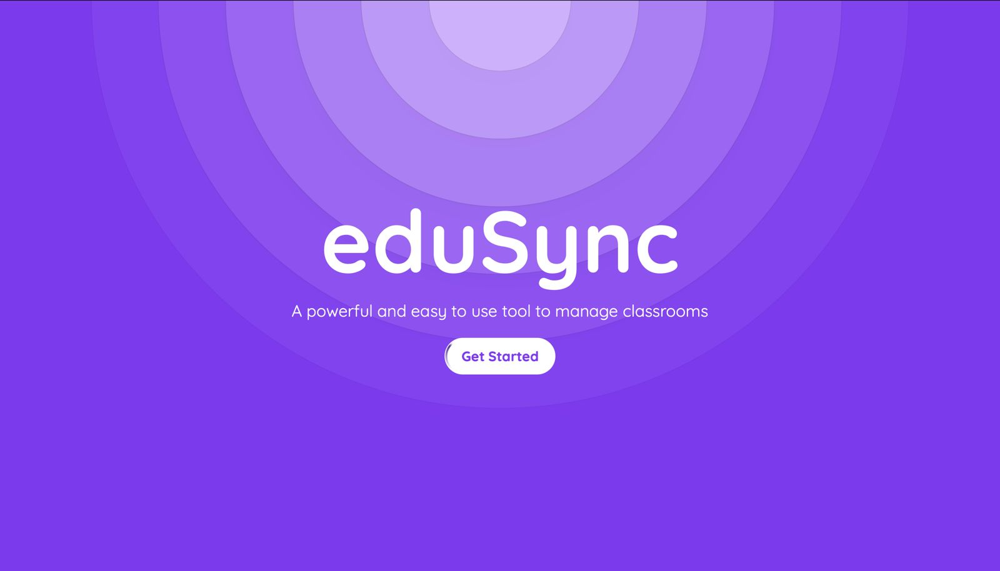
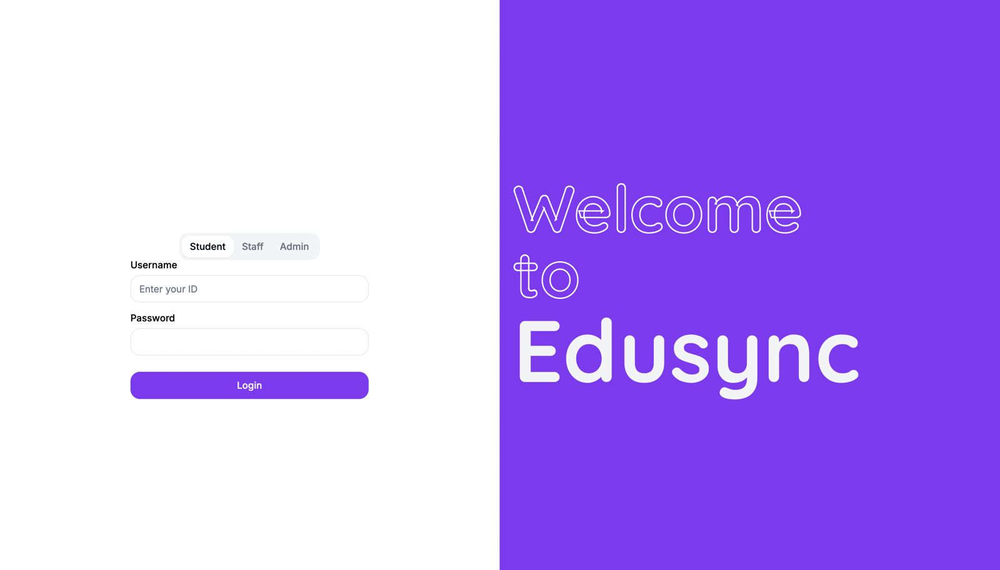
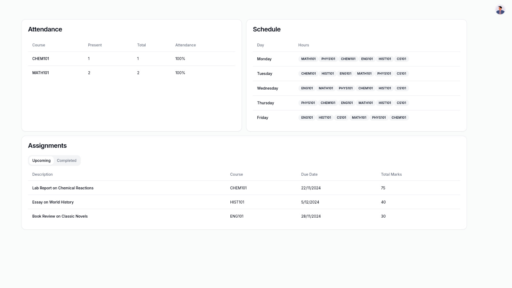
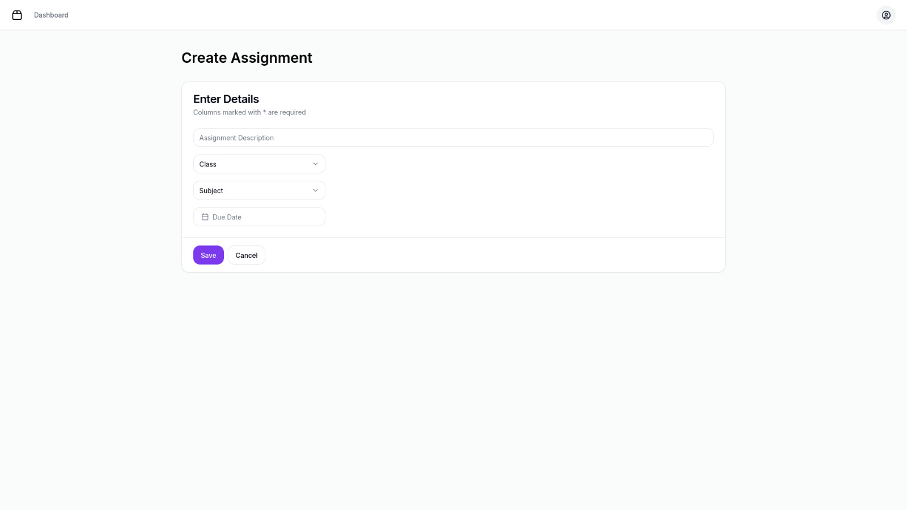
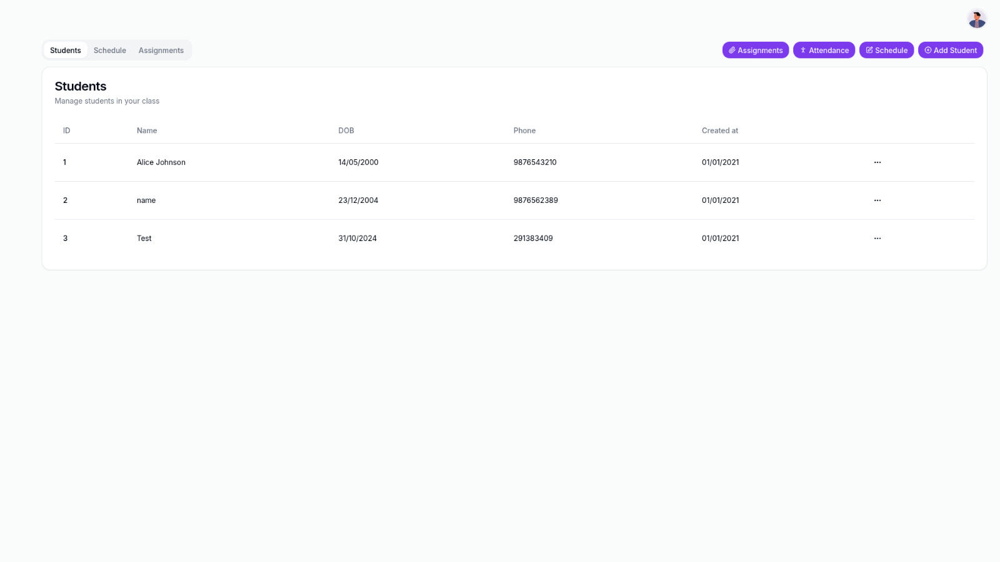
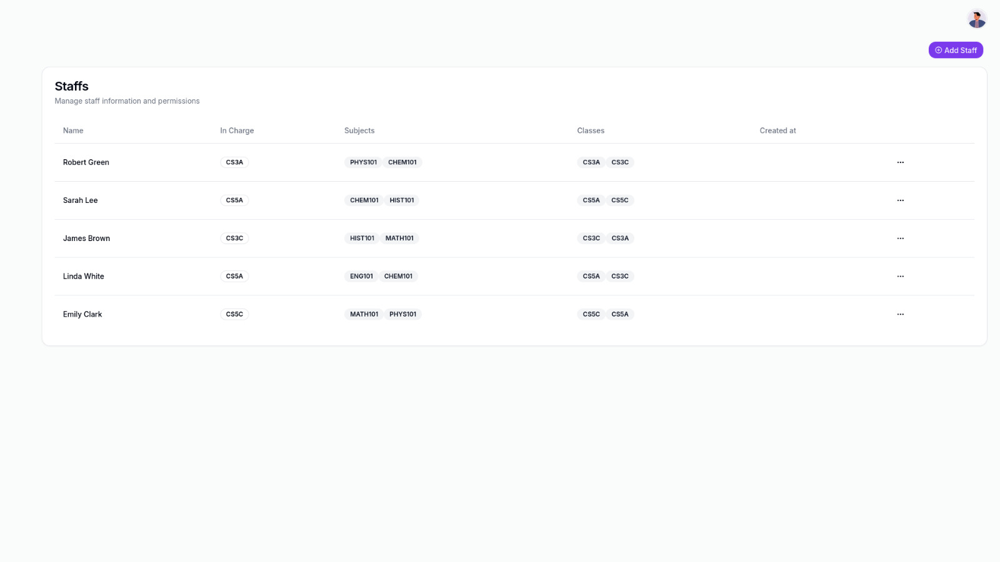
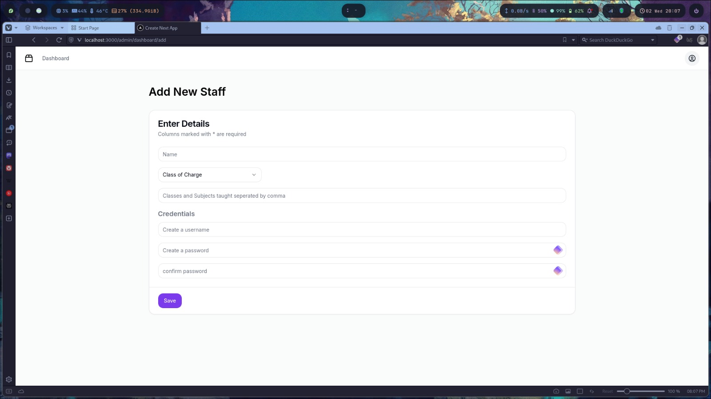

# eduSync

eduSync is a class management system built using Next.js, Node.js, and PostgreSQL.

## Description

eduSync is a comprehensive class management system designed to streamline the process of managing classes, students, assignments, schedules and other such academic data related to a student. It includes both frontend and backend components, developed using Next.js, Node.js and postgreSQL for database.

## Prerequisites

The project has not been hosted yet so you might wanna have to clone the repositories and run them locally inorder to see the working.
Before you begin, ensure you have met the following requirements:

- Node.js installed on your machine
- PostgreSQL database set up
- Git installed on your machine

## Installation

Follow these steps to set up and run the project locally.

### Cloning the Repository

#### Clone the frontend repository:

```bash
git clone https://github.com/n1ved/edusync-frontend.git
```

#### Clone the backend repository:

```bash
git clone https://github.com/nikhilt77/eduSync_Backend.git
```

## Setting up the Frontend

Navigate to the frontend directory:

```bash
cd eduSync-frontend
```

Install the dependencies:

```bash
npm install
```

Start the frontend server:

```bash
npm run dev
```

## Setting up the Backend

Navigate to the backend directory:

```bash
cd ../eduSync_Backend
```

Install the dependencies:

```bash
npm install
```

Set up the PostgreSQL database and configure the environment variables.

Start the backend server:

```bash
npm start
```

## Usage

To use eduSync, follow these steps:

1. Open your browser and navigate to the frontend server URL (usually [http://localhost:3000](http://localhost:3000)).
2. Log in or sign up to access the class management features.

## Contributing

If you want to contribute to this project, please follow these steps:

1. Fork the repository.
2. Create a new branch:
   ```bash
   git checkout -b feature/your-feature-name
   ```
3. Make your changes and commit them:
   ```bash
   git commit -m 'Add some feature'
   ```
4. Push to the branch:
   ```bash
   git push origin feature/your-feature-name
   ```
5. Open a pull request.

## License

This project is licensed under the MIT License - see the [LICENSE](LICENSE) file for details.

## Contact Information

For any questions or feedback, please contact:

**Nikhil** - [GitHub Profile](https://github.com/nikhilt77)
**Nived** - [GitHub Profile](https://github.com/n1ved)
**Rahul** - [GitHub Profile](https://github.com/rahul-ks04)
**Karthik** - [GitHub Profile](https://github.com/Karthik9km)

## Screenshots








